# DermaAI — Skin Lesion Classification (CNN + ResNet)

[](#)
[](#)
[](#)
[](#)
[](#)

DermaAI is a **portfolio-grade medical imaging application**: upload a skin lesion image and get an **AI-assisted classification** (**Benign** vs **Malignant**) with a confidence score and clinician-friendly presentation.

It’s designed to show real-world skills: **CNN/ResNet inference**, **medical-image preprocessing**, **production-style Flask handling**, and a **modern responsive UI**.

---

## Table of Contents

- [What this project demonstrates](#what-this-project-demonstrates)
- [UI preview (screenshots)](#ui-preview-screenshots)
- [System architecture](#system-architecture)
- [Pipeline](#pipeline)
- [Model details](#model-details)
- [Run locally](#run-locally)
- [API](#api)
- [Deployment (Render)](#deployment-render)
- [Safety & disclaimer](#safety--disclaimer)
- [Roadmap](#roadmap)

---

## What this project demonstrates ✨

### 🧠 ML / Medical Imaging

- ✅ **ResNet-based CNN inference** using TensorFlow/Keras
- ✅ **Medical image preprocessing** (RGB conversion, resize to $384\times384$, normalization)
- ✅ **Binary classification** with probability output → label mapping + confidence formatting
- ✅ **Model artifact management** (saved model + checkpoint naming with AUC)

### 🛠️ Engineering / Production mindset

- 🔒 Secure upload handling: **file type validation**, **size limit**, **unique filenames**, safe paths
- 🧾 UX-focused results: **clear badge**, **confidence meter**, **clinical guidance copy**, **print-ready report**
- ☁️ Deployment-ready: `gunicorn` support + `$PORT` awareness for cloud platforms
- 🩺 Health endpoint for monitoring: `GET /api/health`

---

## UI Preview (Screenshots) 📸

> These screenshots are included as **portfolio visuals** (SVG mockups) to keep the repo lightweight and attractive on GitHub.

### Home / Upload Experience


### Result Page (Diagnosis + Confidence)


---

## System Architecture 🏗️

DermaAI is built like a small production web service: a browser UI submits an image to Flask, the server validates and stores it, then runs preprocessing + a ResNet-based CNN to return a clinician-friendly report.

### High-level request flow

```mermaid
flowchart LR
	U[🧑‍⚕️ User / Clinician
	Browser] -->|POST /predict
	multipart image| F[🌐 Flask App
	app.py]
	F --> V[🔎 Validate
	type + size + safe name]
	V --> S[💾 Save Upload
	static/uploads]
	S --> P[🧪 Preprocess
	OpenCV + NumPy
	RGB + 224×224 + normalize]
	P --> M[🧠 ResNet-based CNN
	TensorFlow/Keras
	.keras model]
	M --> R[📊 Result
	label + confidence]
	R --> T[🧾 HTML Report
	result.html]
```



### Components

- **Frontend**: responsive templates (`templates/index.html`, `templates/result.html`) + styling (`static/css/style.css`)
- **Backend**: Flask routes in `app.py` (upload, inference, health)
- **Preprocessing**: OpenCV-based transform to model input
- **Model Serving**: TensorFlow/Keras model loaded once at startup for fast inference
- **Storage**: uploaded images stored in `static/uploads/` with unique filenames

---

## Pipeline 🔁


---

## Model Details 🧬

- **Task:** Binary classification — *Benign* vs *Malignant*
- **Architecture:** ResNet-based CNN
- **Input:** $384 \times 384$ RGB image
- **Preprocessing:** resize + normalization to $[0,1]$
- **Output:** probability score ($p$) for the positive class

### Model Artifacts

- `models/skin_lesion_resnet_cam.keras` — exported model used by the Flask app
- `models/best_epoch5_auc0.9063.weights.h5` — best checkpoint (AUC recorded in filename)

---

## Run Locally

### 1) Install dependencies

```bash
pip install -r requirements.txt
```

### 2) Start the web app

```bash
python app.py
```

Open: `http://localhost:5000`

---

## API

- `GET /api/health` → returns service health + timestamp

---

## Deployment (Render)

This repo includes a ready-to-use Render config in `render.yaml`.

- Build: `pip install -r requirements.txt`
- Start: `gunicorn app:app --bind 0.0.0.0:$PORT`

---

## Safety & Disclaimer

This project is an **assistive AI tool** built for education and demonstration.

- It is **not** a medical device.
- Do **not** use it as a standalone diagnostic system.
- Always consult a qualified clinician for diagnosis and treatment.

---

## Roadmap

- Add explainability outputs (CAM heatmaps overlayed on lesions)
- Add model versioning + experiment tracking
- Add unit tests for preprocessing and prediction endpoints

